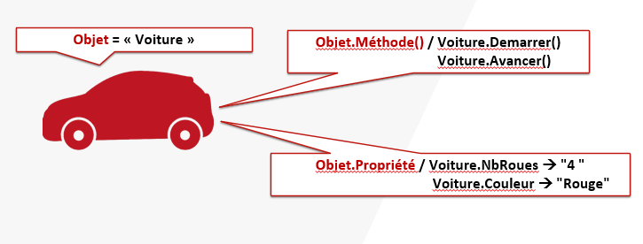

# Les Objets

* Contrairement à **Batch** ou **Bash** qui sont des langages « textes ».Powershell est un langage objet.

* Sous **PowerShell**, chaque commande renverra un objet d’un type précis possédant ses propriétés et ses méthodes.



___
# Le Pipeline

* Le pipeline, symbolisée par le caractère **|** `[AltGr] + [6]` permet de **chainer** plusieurs commandes entre elles.

* Autrement dit, la sortie d'une commande correspond à l'entrée de la suivante.

* Les valeurs des paramètres de la deuxième commande lui sont fourni par la première commande.


```powershell
Get-Process  -Name notepad 
Stop-Process -Name notepad
```

```powershell
Get-Process  -Name notepad | Stop-Process
```

# Get-Member

```powershell
PS> Get-Process | Get-Member

   TypeName: System.Diagnostics.Process

Name                       MemberType     Definition
----                       ----------     ----------
Handles                    AliasProperty  Handles = Handlecount
Name                       AliasProperty  Name = ProcessName
NPM                        AliasProperty  NPM = NonpagedSystemMemorySize64
PM                         AliasProperty  PM = PagedMemorySize64
SI                         AliasProperty  SI = SessionId
VM                         AliasProperty  VM = VirtualMemorySize64
WS                         AliasProperty  WS = WorkingSet64
Parent                     CodeProperty   System.Object Parent{get=GetParentProcess;}
Disposed                   Event          System.EventHandler Disposed(System.Object, System.EventArgs)
ErrorDataReceived          Event          System.Diagnostics.DataReceivedEventHandler ErrorDataReceived(System.Object, System.Diagnostics.…
Exited                     Event          System.EventHandler Exited(System.Object, System.EventArgs)
OutputDataReceived         Event          System.Diagnostics.DataReceivedEventHandler OutputDataReceived(System.Object, System.Diagnostics…
BeginErrorReadLine         Method         void BeginErrorReadLine()
BeginOutputReadLine        Method         void BeginOutputReadLine()
CancelErrorRead            Method         void CancelErrorRead()
CancelOutputRead           Method         void CancelOutputRead()
Close                      Method         void Close()
CloseMainWindow            Method         bool CloseMainWindow()
Dispose                    Method         void Dispose(), void IDisposable.Dispose()
Equals                     Method         bool Equals(System.Object obj)
GetHashCode                Method         int GetHashCode()
GetLifetimeService         Method         System.Object GetLifetimeService()
GetType                    Method         type GetType()
InitializeLifetimeService  Method         System.Object InitializeLifetimeService()
Kill                       Method         void Kill(), void Kill(bool entireProcessTree)
Refresh                    Method         void Refresh()
Start                      Method         bool Start()
ToString                   Method         string ToString()
```

