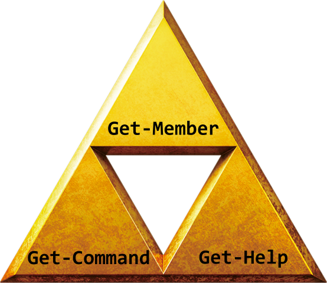

## Syntaxe des commandes

Toutes les commandes PowerShell, appelés **CmdLets** se composent d’un verbe et d’un nom séparé par un tiret. Le résultat de la commande peut être influencer par l'ajout de paramètres.

Chaque **verbe** correspond à un type d'action précis :

| Verb       | Action                                     |
| ---------- | ------------------------------------------ |
| **GET**    | :material-arrow-right: Requeter            |
| **SET**    | :material-arrow-right:Configurer / Définir |
| **IMPORT** | :material-arrow-right:Importer             |
| etc ...    | ...                                        |

!!! note " "
	**`#!powershell Get-Verb`** permet d'obtenir la liste des verbs "approuvés" par les best-practices Powershell

## Les 3 commandes indispensables

| Verb                           | Description                                                                         |
| ------------------------------ | ----------------------------------------------------------------------------------- |
| **`#!powershell Get-Command`** | :material-arrow-right: Lister et chercher des commandes                             |
| **`#!powershell Get-Help`**    | :material-arrow-right: Obtenir l'aide d'une commande                                |
| **`#!powershell Get-Member`**  | :material-arrow-right: Connaitre le type, les propriétés et les méthodes d’un objet |
