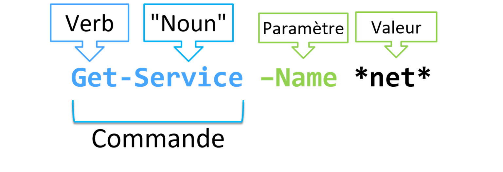

## Syntaxe des commandes

Toutes les commandes PowerShell, appelés **CmdLets** se composent d’un verbe et d’un nom séparé par un tiret. Le résultat de la commande peut être influencer par l'ajout de paramètres.


Par exemple, la commande `#!powershell Get-Service` exécutée telle quelle, renverra l'ensemble des services.

Tandis que la commande `#!powershell Get-Service -Name *Net*` ne renverra que les services contenant *net* dans leur nom.

Chaque **verbe** correspond à un type d'action précis :

| Verb       | Action                                     |
| ---------- | ------------------------------------------ |
| **GET**    | :material-arrow-right: Requeter            |
| **SET**    | :material-arrow-right:Configurer / Définir |
| **IMPORT** | :material-arrow-right:Importer             |
| etc ...    | ...                                        |


!!! note " "
	**`#!powershell Get-Verb`** permet d'obtenir la liste des **verbs** approuvés par les best-practices Powershell


## Les 3 commandes <mark style="background: #FFF3A3A6;">indispensables</mark>


### Get-Command
`#!powershell Get-Command` permet de rechercher une commande en fonction de nom, de son **verb** ou de son module d'appartenance.

```powershell
Get-Command -Name "*process*"
```

```text title="Output"

CommandType     Name                                               Version    Source
-----------     ----                                               -------    ------
Cmdlet          Debug-Process                                      7.0.0.0    Microsoft.PowerShell.Management
Cmdlet          Enter-PSHostProcess                                7.3.4.500  Microsoft.PowerShell.Core
Cmdlet          Exit-PSHostProcess                                 7.3.4.500  Microsoft.PowerShell.Core
Cmdlet          Get-Process                                        7.0.0.0    Microsoft.PowerShell.Management
Cmdlet          Get-PSHostProcessInfo                              7.3.4.500  Microsoft.PowerShell.Core
Cmdlet          Start-Process                                      7.0.0.0    Microsoft.PowerShell.Management
Cmdlet          Stop-Process                                       7.0.0.0    Microsoft.PowerShell.Management
Cmdlet          Wait-Process                                       7.0.0.0    Microsoft.PowerShell.Management


```

### Get-Help

La commande `#!powershell Get-Help` permet d'obtenir une aide sur le fonctionnement d'une commande.

Elle vous permet d'identifier les paramètres attendues, lesquels sont obligatoires ou non, le type de valeurs à leur envoyer, etc ...

```powershell
Get-Help -Name "Get-Service"
```

```text title="Output"

NAME
    Get-Service
    
SYNTAX
    Get-Service [[-Name] <string[]>] [-DependentServices] [-RequiredServices] [-Include <string[]>] [-Exclude <string[]>] [<CommonParameters>]
    
    Get-Service -DisplayName <string[]> [-DependentServices] [-RequiredServices] [-Include <string[]>] [-Exclude <string[]>] [<CommonParameters>]
    
    Get-Service [-DependentServices] [-RequiredServices] [-Include <string[]>] [-Exclude <string[]>] [-InputObject <ServiceController[]>] [<CommonParameters>]
    

ALIASES
    gsv
    

REMARKS
    Get-Help cannot find the Help files for this cmdlet on this computer. It is displaying only partial help.
        -- To download and install Help files for the module that includes this cmdlet, use Update-Help.
        -- To view the Help topic for this cmdlet online, type: "Get-Help Get-Service -Online" or
           go to https://go.microsoft.com/fwlink/?LinkID=2096496.


```

!!! note " "
	L'ajout du paramètre **-Online** à la commande `#!powershell Get-Help`vous envoie sur la page ***Microsoft Docs*** correspondante.

### Get-Member

`#!powershell Get-Help` vous permet d'obtenir "la carte d'identité" d'un objet obtenu par l'éxécution d'une commande ou stocké dans une variable.
Elle vous permettra de connaitre:

- Son **type**
- Ses **propriétés**
- Ses **méthodes**


```powershell
Get-Process | Get-Member
```

```text title="Output ❱"
   TypeName: System.Diagnostics.Process

Name                       MemberType     Definition
----                       ----------     ----------
Disposed                   Event          System.EventHandler Disposed(System.Object, System.EventArgs)
ErrorDataReceived          Event          System.Diagnostics.DataReceivedEventHandler ErrorDataReceived(System.Object, System.Diagnostics.…
Exited                     Event          System.EventHandler Exited(System.Object, System.EventArgs)
OutputDataReceived         Event          System.Diagnostics.DataReceivedEventHandler OutputDataReceived(System.Object, System.Diagnostics…
BeginErrorReadLine         Method         void BeginErrorReadLine()
BeginOutputReadLine        Method         void BeginOutputReadLine()
CancelErrorRead            Method         void CancelErrorRead()
CancelOutputRead           Method         void CancelOutputRead()
Close                      Method         void Close()
CloseMainWindow            Method         bool CloseMainWindow()
Dispose                    Method         void Dispose(), void IDisposable.Dispose()
Equals                     Method         bool Equals(System.Object obj)
GetHashCode                Method         int GetHashCode()
GetLifetimeService         Method         System.Object GetLifetimeService()
GetType                    Method         type GetType()
InitializeLifetimeService  Method         System.Object InitializeLifetimeService()
Kill                       Method         void Kill(), void Kill(bool entireProcessTree)
Refresh                    Method         void Refresh()
Start                      Method         bool Start()
ToString                   Method         string ToString()
```


___

| Verb                           | Description                                                                         |
| ------------------------------ | ----------------------------------------------------------------------------------- |
| **`#!powershell Get-Command`** | :material-arrow-right: Lister et chercher des commandes                             |
| **`#!powershell Get-Help`**    | :material-arrow-right: Obtenir l'aide d'une commande                                |
| **`#!powershell Get-Member`**  | :material-arrow-right: Connaitre le type, les propriétés et les méthodes d’un objet |
