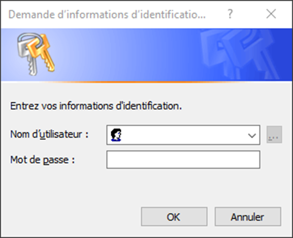
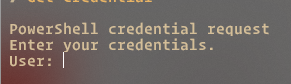

# Credentials

[!badge target="blank" text="Get-Credential"](https://learn.microsoft.com/fr-fr/powershell/module/microsoft.powershell.security/get-credential?view=powershell-7.3) permet l'enregistrement dans une variable des données d'authentification qui pourront être ensuite envoyé aux commandes ayant un paramètre **-Credential**


```powershell
$Creds = Get-Credential
```



```powershell
Set-ADUser "jmazoyer" –Enable $False –Credential $Creds
```

La commande s'éxécutera alors avec les droits de l'utilisateur renseigné dans la variables [!badge variant="danger" target="blank" text="$Creds"]